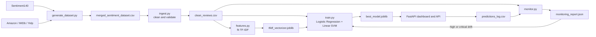

# Sentiment Classifier

A reproducible sentiment-classification project for product reviews and support-ticket style text. The project cleans and validates labelled data, fits a reusable TF-IDF representation, trains Logistic Regression and Linear SVM candidates, promotes the best model, serves predictions through FastAPI, and monitors production drift.

## Architecture



The canonical dataset labels are `1` = positive, `0` = negative, and `2` = neutral. The model converts these codes to the string classes `positive`, `negative`, and `neutral`.

## Features

- Three-class sentiment labels: `negative`, `neutral`, and `positive`
- Dataset label codes: `1` = positive, `0` = negative, `2` = neutral
- Auditable ingestion and validation outputs
- Deterministic neutral-class augmentation to at least 1,000 examples
- TF-IDF unigram/bigram features with up to 5,000 features
- Logistic Regression and Linear SVM model comparison
- MLflow experiment tracking and DVC pipeline stages
- FastAPI prediction and batch-prediction endpoints
- PSI-based label and text-length drift monitoring
- Optional threshold-based retraining
- Docker Compose deployment

## Project Structure

```text
data/       Raw, cleaned, merged, and versioned datasets
models/     TF-IDF vectorizer and promoted model artifacts
reports/    Validation, feature, model, and monitoring reports
src/        Ingestion, feature, training, API, and monitoring code
tests/      Pipeline and API tests
```

## Setup on Windows

Prerequisites: Python 3.14, PowerShell, and Kaggle credentials for downloading the source datasets. Run commands from the repository root and use the project interpreter:

```powershell
py -3.14 -m venv .venv
.\.venv\Scripts\Activate.ps1
python -m pip install -r requirements.txt
```

Authenticate with Kaggle before generating data:

```powershell
kaggle auth login
```

If the environment already exists:

```powershell
.\.venv\Scripts\python.exe -m pip install -r requirements.txt
```

## Run the Pipeline

Generate and combine both source datasets first:

```powershell
.\.venv\Scripts\python.exe src/generate_dataset.py
```

Run each stage from the repository root:

```powershell
.\.venv\Scripts\python.exe src/ingest.py
.\.venv\Scripts\python.exe src/features.py
.\.venv\Scripts\python.exe src/train.py
```

Or run the DVC pipeline:

```powershell
dvc repro
```

The training stage writes the selected model to `models/best_model.joblib` and the comparison results to `reports/model_comparison.json`.

During ingestion, source neutral rows are preserved and deterministic neutral review examples are added until the cleaned dataset contains at least 1,000 neutral rows. This prevents the small neutral class in the source review datasets from being underrepresented during training.

## Run the API

```powershell
.\.venv\Scripts\python.exe -m uvicorn src.api:app --host 127.0.0.1 --port 8000
```

Open `http://127.0.0.1:8000` for the dashboard. Useful endpoints:

| Method | Endpoint | Purpose |
| --- | --- | --- |
| `GET` | `/health` | Service and model status |
| `GET` | `/model-info` | Promoted model metadata |
| `GET` | `/products` | Example product catalogue |
| `POST` | `/predict` | Classify one text value |
| `POST` | `/predict/batch` | Classify a list of text values |

Example request:

```powershell
Invoke-RestMethod -Uri http://127.0.0.1:8000/predict `
	-Method Post `
	-ContentType "application/json" `
	-Body '{"text":"The battery life is excellent."}'
```

Predictions are appended to `logs/predictions_log.csv`.

## Monitor Drift

Generate a monitoring report using the baseline dataset and recent prediction log:

```powershell
.\.venv\Scripts\python.exe -m src.monitor
```

The CLI supports these inputs:

```powershell
.\.venv\Scripts\python.exe -m src.monitor `
	--baseline data/clean_reviews.csv `
	--drift_csv reports/drift_reviews.csv `
	--predictions logs/predictions_log.csv `
	--report reports/monitoring_report.json
```

When `--drift_csv` exists, it is used as the current observation set. Otherwise, monitoring falls back to `--predictions`. The report contains label PSI, text-length PSI, edge-case rate, drift status, and the observation source.

Retraining is opt-in and requires both a high/critical drift status and at least 500 observations:

```powershell
.\.venv\Scripts\python.exe -m src.monitor --retrain
```

## Tests

```powershell
.\.venv\Scripts\python.exe -m pytest -q tests
```

## Docker Compose

Build and start the API container:

```powershell
docker compose up -d --build
```

The service is available at `http://localhost:8000`. Check its state with:

```powershell
docker compose ps
docker compose logs -f sentiment-api
```

Stop the service with:

```powershell
docker compose down
```

The container uses the Linux-compatible dependencies from `requirements.txt` and excludes the Windows-only `pywin32` package during the image build.

## MLflow

Start the local MLflow UI:

```powershell
mlflow ui --backend-store-uri sqlite:///mlflow.db
```

Then open `http://127.0.0.1:5000`. Training runs are recorded under the `sentiment-classifier` experiment.

## Reproducibility Notes

- DVC tracks dataset and pipeline outputs.
- Training uses a fixed default split seed of `42`.
- The API and training pipeline share the saved TF-IDF vectorizer.
- Model reports and promoted artifacts are stored under `reports/` and `models/`.
# Package for submission
zip -r submission.zip . -x '*.pyc' -x '*/__pycache__/*'
